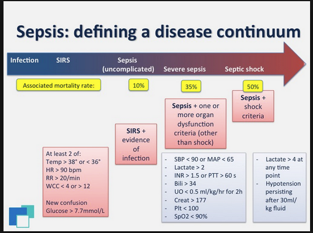

**SEPSIS_PROJECT OVERVIEW**

Sepsis remains a major global public health challenge. In the United States, nearly **1.7 million** people develop sepsis each year, and approximately **270,000** die from it. More than **one-third of all in-hospital deaths** are associated with sepsis. Globally, an estimated **30 million** people develop sepsis annually, resulting in **6 million deaths**.

In the U.S., sepsis management costs exceed **$24 billion** per year—about **13% of total hospital expenditures**—with most costs driven by cases that develop during hospitalization. In low- and middle-income countries, the financial burden is compounded by limited resources and a higher risk of adverse outcomes.

Despite its prevalence, **early and reliable identification of sepsis remains difficult** due to its broad and syndromic presentation, often leading to delays in diagnosis and treatment. Overall, sepsis contributes significantly to morbidity, mortality, and healthcare spending worldwide.

